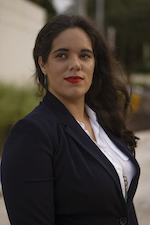
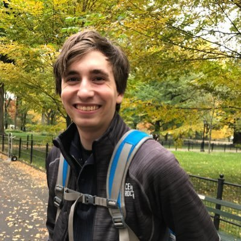

# Yesenia Yser

Yesenia is a Senior Software Security Engineer for the Alpha-Omega OpenSSF project. She holds a Bachelor's degree in Computer science and a Masters in Digital Forensics. Over the last ten years, her career has been dedicated to being a servant leader to the software engineer and cybersecurity realm, pioneering teams and systems for Security Operations, DevSecOps, Supply Chain Security, by executing on the never-been-done. As a cyber big sister, she has founded several Women in Tech organizations, particularly in the South Florida area, and is a co-founder in the Latinas In Cyber organization. In her free time, she is a practitioner and instructor of Brazilian Jiu Jitsu and growing the Women’s Self-Defense classes at her academy.

# Jonathan Leitschuh

Jonathan Leitschuh is a Senior Software Security Researcher currently working for the Open Source Security Foundation (OpenSSF). He is responsible for thousands of automatically generated pull requests, fixing vulnerabilities across OSS. He was the first Dan Kaminsky Fellow and former Software Engineer. Jonathan is best known for his July 2019 bombshell Zoom 0-day vulnerability disclosure. He is amongst the most prolific OSS researchers on GitHub by advisory credit. He’s both a GitHub Star and GitHub Security Ambassador. In 2019 he championed an industry-wide initiative to get all major artifact servers in the JVM ecosystem to formally decommission the support of HTTP in favor of HTTPS only. He has spoken at many conferences from BSides, ShmooCon, Sec-T, & GitHub Universe, to Black Hat, & DEFCON.
