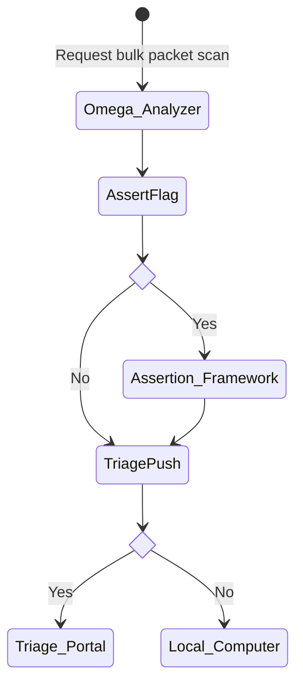

# Analyzer

## Objective
- Enhancement to the analyzer to combine the scan results and assertion report into a single file, while providing the additional functionality from sending the file to local or API instance.

## Use Case
1. Support functionality to support uploading the single SARIF report to the Triage Portal API (local, production, or stdout)
1. Support functionality to combine scan results and assertion into a single run and a SARIF report
1. Design requirements for input improvements to support cadence runs and bulk request (i.e, scan 10 oss projects at once)
1. Use the Analyzer to scan pypi open source projects and report status

## Diagram

## Requirements

### Use Case 1
- [x] Push 'summary-results.sarif' to the triage-portal
- [x] Triage Portal credentials should be supported as environment variable (be sure to change the .env template)
- [x] Triage Portal Credentials should be passed as parameters when running the ./runtools.sh command
- Exception Handling on the following:
  - [x] Triage Portal isn't available
	- [x] Perform 3 Retry Attempts, then default to stdout
  - [x] User hasn't supplied enough information to connect to triage portal
- [x] Error should be returned to the user via stdout with a standard log message and HTTP error code, if necessary. 
  - If error occurs on the triage portal, then user should get the HTTP code plus error message
- [x] Should be able to scan all packages (with a Focus on being more or less compatible with JavaScript [npm], Go (Golang) [go] and Python [PyPi]) 

### Use Case 2 - Goes beyond scope of the analyzer and is regarded as a completely different component
- [ ] Running assertion on a package should be supported by environment variables
  - [ ] For frequent and/or cadence, support an assertionReport option to always run the assertion report
- [ ] Running assertion on a package should be supported by passing as an parameter when running the ./runtools.sh command
- [ ] The scan and assertion should run at the same time
  - [ ] Assume that each will take time (assertion and scan)
  - [ ] Prevent "timeouts" as best as possible
- [ ] The assertion report should be included in the final 'summary-results.sarif' file
- [ ] The assertion report scheme should have a key-value pair for the triage portal to easily identify the report data required for parsing
  - ex. "assertion-results"={}

<!-- Where is the missing test case #3 -->

### Use Case 4
- [x] Keep results in Google Drive (until prod triage portal)
- [x] Top-level stats on Google Drive
- [x] Scanning 10 pypis a week
  - [x] Record failures and status of results
  - [x] Record time to scan 
  - [x] Record summary-results.sarif file size
  - [x] Record date of scan

## Bug fixes and additional functionalities implemented
- [./runtools.sh argument and options parsing](https://github.com/ossf/alpha-omega/pull/162)

- [./runtools.sh dynamic version resolution](https://github.com/ossf/alpha-omega/pull/162)

- [Add Golang Support](https://github.com/ossf/alpha-omega/pull/210)

- MD5 Collision Hash Pentesting <!-- TODO: Add report of the pentest -->

- Analytics on a typical pypi package and cost to run  <!-- TODO: whitepaper -->

- [Containerized oaf (Omega Assertion Framework)](https://github.com/ossf/alpha-omega/pull/214)

- Bulk Scan POC (Proof-of-concept) <!-- TODO: Add script and do a PR -->

- Bug Fixes!

## Security Requirements
- [x] Threat: Maniupulation of Binaries / Files
  - [x] Remediation: Checksum validation
- [x] Manipulation on package name / version number
  - Package and Version Validation
- :heavy_check_mark: Erroneous data mitgiation
  -  [x] One package per container

## Acceptance Criteria
- [x] The Analyzer pushes the final SARIF file to the Triage Portal's Endpoint
- [x] The Analyzer has multiple methods to pass the credentials to establish a connection to the Triage Portal
  - Environment Variables or as an argument
- [x] The analyzer should have support for JavaScript [npm], and Python [PyPi]
- [x] The analyzer is able to create a SARIF file with only the Scan results
- [x] The analyzer has been tested with the Omega Top 10k list despite success of the scan.
- [x] Tested Omega top 10k list has been documented based on its success and failure
  - Tested on the pypi packages from the Omega top 10k, not the complete 10k
- [x] The anayzer is used every week to scan 10 pypi project from the Omega Top 10k list
- [x] The results from the scanned pypi projects are recorded to include scan dureation and success
- [x] Send a checksum from the analyzer side

## Future Improvements (Includes Improvements to the Omega Assertion Framework (oaf))
- [ ] The analyzer is able to create a SARIF file to include both the scan results and the assertion report
- [ ] Test Full Omega top 10k list has been documented based on its success and failure
- Triage Push Exception Handling
  - [ ] Triage Portal does not support or issue with the formatting
- [ ] The analyzer has exception handling for the SARIF file upload
  - This can be done by adding `--include` tag to the `curl` command and grepping for successes. 
- [ ] Migrate to a micro-services architecture, with `Omega Analyzer Toolshed (oat)`, `Omega Assertion Framework (oaf)`, `Omega Fuzzing (ofu)` being separate components that can feed into one place 
- [ ] Add Documentation on how to run the `oaf`
- [ ] Automatic Testing and Insight into which language packages work and don't work on the assertion framework

## Testing
| Test No | Description | Files  | Steps 
| :---- | :---- | :---- | :---- 
| 1 | Analyzer Build Script           | | [Steps](#1)
| 2 | Analyzer Build Script with Flag | | [Steps](#2)
| 3 | Version Resolution              | | [Steps](#3)
| 4 | Analyzer do assertion           | | [Steps](#4)
| 5 | Failure on Errorenous Version   | | [Steps](#5)
| 6 | Failure on invalid input format | | [Steps](#6)
| 7 | ....

### 1
| Steps | Linux Steps | Current Directory 
| :----- | :----: | :----
| Clone Alpha-Omega Repository | `git clone git@github.com:ossf/alpha-omega.git` | .
| Change Directory to omega/analyzer | `cd omega/analyzer` | ./alpha-omega/omega/analyzer 
| Build Container (using build script) | `./build.sh` | ./alpha-omega/omega/analyzer
| Run toolshed container using format | `docker run --rm -it --env-file <.env containing the libaries io creds> openssf/omega-toolshed pkg:npm/left-pad@latest` | ./alpha-omega/omega/analyzer

### 2
| Steps | Linux Steps | Current Directory 
| :----- | :----: | :----
| Clone Alpha-Omega Repository | `git clone git@github.com:ossf/alpha-omega.git` | .
| Change Directory to omega/analyzer | `cd omega/analyzer` | ./alpha-omega/omega/analyzer 
| Build Container (using build script with force flag) | `./build.sh -f` | ./alpha-omega/omega/analyzer
| Run toolshed container using format | `docker run --rm -it --env-file <.env containing the libaries io creds> openssf/omega-toolshed pkg:npm/left-pad@latest` | ./alpha-omega/omega/analyzer

### 3
| Steps | Linux Steps | Current Directory 
| :----- | :----: | :----
| Clone Alpha-Omega Repository | `git clone git@github.com:ossf/alpha-omega.git` | .
| Change Directory to omega/analyzer | `cd omega/analyzer` | ./alpha-omega/omega/analyzer 
| Build Container (using build script) | `./build.sh` | ./alpha-omega/omega/analyzer
| Run toolshed container using format | `docker run --rm -it --env-file <.env containing the libaries io creds> openssf/omega-toolshed pkg:npm/left-pad@latest` | ./alpha-omega/omega/analyzer
| Verify that @latest resolves to a version (i.e returns an output directory | --- | ./alpha-omega/omega/analyzer

### 4
| Steps | Linux Steps | Current Directory 
| :----- | :----: | :----
| Clone Alpha-Omega Repository | `git clone git@github.com:ossf/alpha-omega.git` | .
| Change Directory to omega/analyzer | `cd omega/analyzer` | ./alpha-omega/omega/analyzer 
| Build Container (using build script) | `./build.sh` | ./alpha-omega/omega/analyzer
| Run toolshed container using format | `docker run --rm -it --env-file <.env containing the libaries io creds> openssf/omega-toolshed pkg:npm/left-pad@latest` | ./alpha-omega/omega/analyzer
| Verify that @latest resolves to a version (i.e returns an output directory | --- | ./alpha-omega/omega/analyzer
| Verify that assertion results are within the summary-results.sarif file | `find . -name 'summary-results.sarif' -exec grep 'assertion-results' {} \;` | ./alpha-omega/omega/analyzer

- -v .:/opt/export is used to mount to get content from the container to local machine

### 5
| Steps | Linux Steps | Current Directory 
| :----- | :----: | :----
| Clone Alpha-Omega Repository | `git clone git@github.com:ossf/alpha-omega.git` | .
| Change Directory to omega/analyzer | `cd omega/analyzer` | ./alpha-omega/omega/analyzer 
| Build Container (using build script) | `./build.sh` | ./alpha-omega/omega/analyzer
| Run toolshed container using format | `docker run --rm -it --env-file <.env containing the libaries io creds> openssf/omega-toolshed pkg:npm/left-pad@latest` | ./alpha-omega/omega/analyzer
| Verify that container fails (outputs could not find package: Package could not be found, nothing to do) | --- | ./alpha-omega/omega/analyzer

### 6 
| Steps | Linux Steps | Current Directory 
| :----- | :----: | :----
| Clone Alpha-Omega Repository | `git clone git@github.com:ossf/alpha-omega.git` | .
| Change Directory to omega/analyzer | `cd omega/analyzer` | ./alpha-omega/omega/analyzer 
| Build Container (using build script) | `./build.sh` | ./alpha-omega/omega/analyzer
| Run toolshed container using format | `docker run --rm -it --env-file <.env containing the libraries io creds> openssf/omega-toolshed npm/left-pad@latest` | ./alpha-omega/omega/analyzer
| Verify that container fails execution (Unable to parse Package Url) | ---- | ./alpha-omega/omega/analyzer

