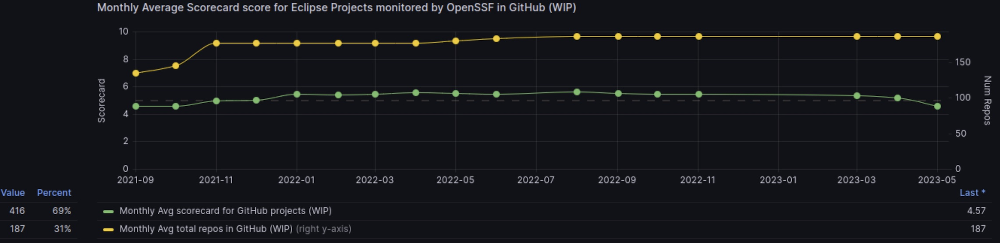

# Eclipse Foundation for April 2023

## GitHub organizations and repositories management

[OtterDog](https://gitlab.eclipse.org/eclipsefdn/security/otterdog) is now in use in one major project within the Eclipse Foundation ([Adoptium](https://github.com/adoptium)) which serves as a showcase and demonstration project to further improve the usage and processes of the tool.

A validation workflow was added that automatically runs for created PRs and highlights the changes that otterdog will apply based on the contents of the PR. On top of that the core of the tool has been refactored to fully support a typed data model that is internally maintained which allows quicker addition of new features. A full list of changes is [available](https://gitlab.eclipse.org/eclipsefdn/security/otterdog/-/blob/main/CHANGELOG.md)

## SLSA tools

The migration to the jenkinsci github organization has been completed. The plugin is now hosted at the [Jenkins' GitHub organization](https://github.com/jenkinsci/slsa-plugin). Work has been started to support the recently released v1.0 SLSA provenance standard and make a first release of the plugin.

## Vulnerability reporting process rework

We've the new vulnerability reporting and CVE request process to the community during a Virtual Eclipse Community MeetUp (vECM). The recording is available for everyone as a reference: https://www.youtube.com/watch?v=SDm477kS_g0&list=PLy7t4z5SYNaSr5Bo3Ty1Te5f8YyBLmKBs

A similar presentation was given internally to the Eclipse Foundation staff.

## Project security audits

Eclipse Jetty and Eclipse Mosquitto teams are working on the subjects from the draft reports.

Eclipse JKube audit is starting in May.

We have finished interviewing and explaining the process to candidate projects for the next round of audits.

## Helping projects with implementing supply chain security best practices

* [Pinning GitHub actions](https://github.com/eclipse-m2e/m2e-core/pull/1352) in [m2e/m2e-core](https://github.com/eclipse-m2e/m2e-core/)
* [Generating SBOM](https://github.com/eclipse-m2e/m2e-core/pull/1361) in [m2e/m2e-core](https://github.com/eclipse-m2e/m2e-core/)
* [Generating SBOM](https://github.com/eclipse/dash-licenses/issues/226) in [eclipse/dash-licenses](https://github.com/eclipse/dash-licenses/)

We also started an internal dashboard to keep track of the number of installation of Scorecard on our GitHub repositories and the average score:

# Sigstore deployment

We've started experimenting with deploying our own sigstore instance (fulcio+trillian+ctlog) to our OKD-based infrastructure.