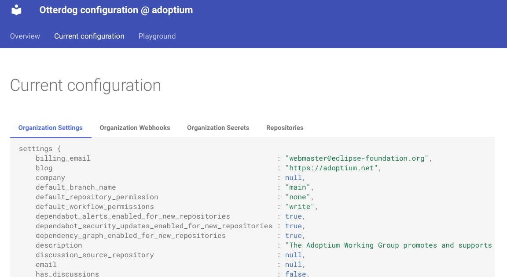

# Eclipse Foundation's update — August 2023

## Communication

We continue the promotion of `SECURITY.md` files. We also pushed PRs to some key projects to help them get started with defining security policy:

* [Eclipse Platform](https://github.com/eclipse-platform/.github/pull/134) — ✅ merged
* [Eclipse JDT](https://github.com/eclipse-jdt/.github/pull/21)
* [Eclipse PDE](https://github.com/eclipse-pde/.github/pull/4)

We have added clarifications to the [Eclipse Project Handbook](https://www.eclipse.org/projects/handbook/) about [vulnerability reporting](https://www.eclipse.org/projects/handbook/#vulnerability). The update includes clarifications on confidential issues usage and the presence of the `.eclipsefdn` directory.

Finally, a [security tutorial](https://www.eclipsecon.org/2023/sessions/supply-chain-security-best-practices-open-source-projects) has been accepted to the program of EclipseCon, and we have started preparing the detailed plan.

## GitHub organizations and repositories management

The number of EF projects that has [OtterDog](https://gitlab.eclipse.org/eclipsefdn/security/otterdog) enabled has grown to 33. Each configured GitHub organization now has a automatically generated status page (e.g. https://adoptium.github.io/.eclipsefdn/). This page displays the current configuration of the organization:

There is also a tabular view of important settings for each repository (e.g. branch protection, secret scanning) for projects to easily spot any configuration discrepancy between repositories:

as well as provides a playground for editing the configuration.

The full list of changes is available at https://gitlab.eclipse.org/eclipsefdn/security/otterdog/-/blob/main/CHANGELOG.md.

Additionally we started improving the baseline of our projects by enforcing some security related settings via the default configuration and enabling [secret scanning](https://docs.github.com/en/code-security/secret-scanning/about-secret-scanning) for all configured organizations. We pushed 24 PRs in that sense, 7 PRs have been merged to date.

* [eclipse-babel](https://github.com/eclipse-babel/.eclipsefdn/pull/2)
* [eclipse-cbi](https://github.com/eclipse-cbi/.eclipsefdn/pull/3) — ✅ merged
* [eclipse-cdt-cloud](https://github.com/eclipse-cdt-cloud/.eclipsefdn/pull/4) — ✅ merged
* [eclipse-cdt](https://github.com/eclipse-cdt/.eclipsefdn/pull/3) — ✅ merged
* [eclipse-chariott](https://github.com/eclipse-chariott/.eclipsefdn/pull/4) — ✅ merged
* [eclipse-embed-cdt](https://github.com/eclipse-embed-cdt/.eclipsefdn/pull/1)
* [eclipse-emf](https://github.com/eclipse-emf/.eclipsefdn/pull/1)
* [eclipse-esmf](https://github.com/eclipse-esmf/.eclipsefdn/pull/4)
* [eclipse-glsp](https://github.com/eclipse-glsp/.eclipsefdn/pull/2)
* [eclipse-jdt](https://github.com/eclipse-jdt/.eclipsefdn/pull/2)
* [eclipse-justj](https://github.com/eclipse-justj/.eclipsefdn/pull/2) — ✅ merged
* [eclipse-kuksa](https://github.com/eclipse-kuksa/.eclipsefdn/pull/1)
* [eclipse-leda](https://github.com/eclipse-leda/.eclipsefdn/pull/2)
* [eclipse-lsp4j](https://github.com/eclipse-lsp4j/.eclipsefdn/pull/1) — ✅ merged
* [eclipse-mylyn](https://github.com/eclipse-mylyn/.eclipsefdn/pull/2)
* [eclipse-packaging](https://github.com/eclipse-packaging/.eclipsefdn/pull/1)
* [eclipse-pdt](https://github.com/eclipse-pdt/.eclipsefdn/pull/1)
* [eclipse-platform](https://github.com/eclipse-platform/.eclipsefdn/pull/2)
* [eclipse-sirius](https://github.com/eclipse-sirius/.eclipsefdn/pull/5) — ✅ merged
* [eclipse-thingweb](https://github.com/eclipse-thingweb/.eclipsefdn/pull/6)
* [eclipse-tractusx](https://github.com/eclipse-tractusx/.eclipsefdn/pull/26)
* [eclipse-vertx](https://github.com/eclipse-vertx/.eclipsefdn/pull/2)
* [eclipse-volttron](https://github.com/eclipse-volttron/.eclipsefdn/pull/4)
* [eclipse-wildwebdeveloper](https://github.com/eclipse-wildwebdeveloper/.eclipsefdn/pull/1)

## SLSA tools

The Adoptium project is willing to use the SLSA Jenkins plugin to generate their already existing build provenance in SLSA in-toto format. Work has started to incorporate the information as generated during a build into the SLSA plugin for inclusion into the SLSA provenance.

## Sigstore integration

A staging instance of the OpenID Connect (OIDC) provider has been deployed on-premise. This staging OIDC provider has also been recognized by the staging instance of Sigstore. This development is a necessary step for future production deployments and facilitates the next phase of testing and evaluation.

## SBOMs

We have generated SBOMs for JakartaEE artifacts using the [CycloneDX Maven Plugin](https://github.com/CycloneDX/cyclonedx-maven-plugin). For JakartaEE version 10, SBOMs have been produced for 32 of the 38 available artifacts. For JakartaEE version 9.1, 14 of the 41 artifacts have SBOMs. Our current focus is on understanding the issues that have prevented the generation of SBOMs for the remaining artifacts in both versions. Additionally, we are evaluating various tools and services to explore the applications and advantages of utilizing these generated SBOMs in different contexts.

## Infrastructure Security Posture

We continuously monitor the external security posture of our internet-facing assets using [UpGuard BreachSight](https://www.upguard.com/product/breachsight). Over the last five months, the security score have maintained a minimum of [840 out of a possible 950](https://www.upguard.com/blog/what-are-security-ratings#:~:text=With%20UpGuard%2C%20an%20organization's%20security,risks%20they%20are%20exposed%20to.). High-severity findings are addressed promptly, and we are also working to resolve lower-risk issues as they are identified.
