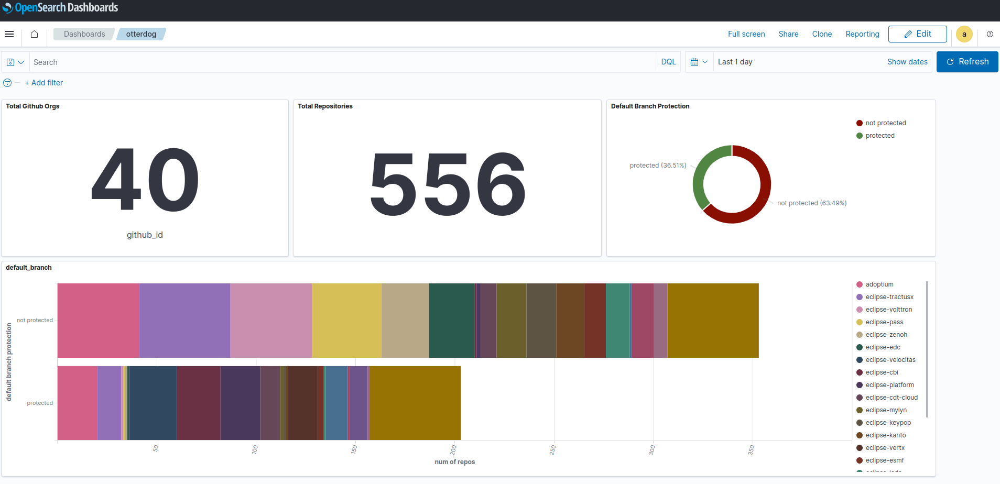

# Eclipse Foundation's update — September 2023

## GitHub organizations and repositories management

The number of EF projects that has Otterdog enabled has grown to 40: https://eclipsefdn.github.io/otterdog-configs/

Support for workflow settings both on organizational and repository level has been added. The full list of changes is available at https://gitlab.eclipse.org/eclipsefdn/security/otterdog/-/blob/main/CHANGELOG.md.

## SLSA tools

A [first official version](https://plugins.jenkins.io/slsa/releases) of the SLSA Provenance Jenkins plugin has been released.

## GitHub organizations and repositories management

All repositories and organization managed by Otterdog now have secret scanning enabled. All 24 PRs that we created have been merged.

We've opened issues on projects to enable branch protection rules on their main branches. Otterdog currently manages 556 repositories accros 40 organizations. 203 (36.51%) of those repositories have their main branch protected to date.

We've started to track these data points in a dashboard:

## SBOMs

* We have completed the generation of SBOMs for all 38 JakartaEE v10 artifacts using the CycloneDX Maven Plugin: https://gitlab.eclipse.org/eclipsefdn/security/jakartaee-sboms
* We have built a SBOM for Eclipse Jersey v3.1.3: https://github.com/JakartaEE-sbom-poc/jakartaee-sbom-poc.

## Sigstore

* The upgrade of our OIDC provider has been postponed to October 6th, related to problems identified during the previously scheduled upgrade. Encountered problems have been resolved and tested by stakeholders.
* Setbacks on already running (staging) setup have backtracked the status. Waiting on Fulcio issue [#1358](https://github.com/sigstore/fulcio/issues/1358) but attentive for time constraints.

## Internal infrastructure security improvment 

* We have requested and helped with the remediation of risks associated with the worst 2 offending domains to date. Among others, the identified issues were:
  * Deprecated TLS versions usage
  * No redirection from HTTP to HTTPS
  * Outdated servers software with vulnerabilities
* We have started to roll out 2FA requirement with hardware tokens (FIDO2) for all staff on the most critical services.

## Others

* Eclipse JKube security audit has been published: https://blogs.eclipse.org/post/mikaël-barbero/eclipse-foundation-publishes-results-eclipse-jkube-security-audit
* We're preparing tutorial "Supply Chain Security Best Practices for Open Source Projects" that we will be giving at EclipseCon next month: https://www.eclipsecon.org/2023/sessions/supply-chain-security-best-practices-open-source-projects
* We attended to OpenSSF Day Europe in Bilbao.
* We've given a talk at Bitkom Forum Open Source in Erfurt, Germany titled "Securing Eclipse Foundation's Projects Software Supply Chain" https://www.bitkom.org/bfoss23
