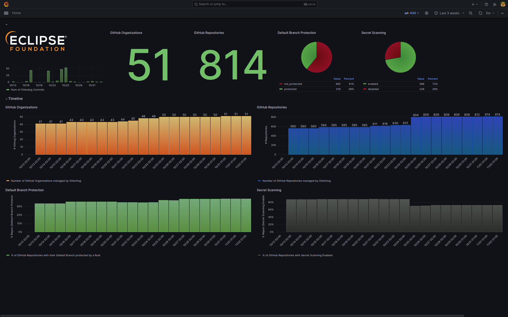

# Eclipse Foundation's Update — October 2023

## GitHub Organizations and Repositories Management

The number of Eclipse Foundation projects that have OtterDog enabled has grown to [50](https://eclipsefdn.github.io/otterdog-configs/) (+10 from last month), including Eclipse Jetty, Jakarta EE, and EE4J. 

Apart from smaller changes, support for [repository rulesets](https://docs.github.com/en/repositories/configuring-branches-and-merges-in-your-repository/managing-rulesets/about-rulesets) has been added, which was triggered by a direct need of one of our projects. The full list of changes is available in our [CHANGELOG](https://gitlab.eclipse.org/eclipsefdn/security/otterdog/-/blob/main/CHANGELOG.md). 

We've also continued implementing a lightweight dashboard to track some security metrics that we can easily get from OtterDog and that have an impact on the projects' security posture:
* **Default branch protection**: about 39% of repositories have their default branch protected by a branch protection rule. We are actively promoting and helping projects implement such rules on their repositories.
* **Secret Scanning**: 72% of repositories managed by OtterDog have [secret scanning](https://docs.github.com/en/code-security/secret-scanning/about-secret-scanning) enabled.

## Tutorial on Securing Software Supply Chain at EclipseCon 2023

A [tutorial on securing the software supply chain](https://www.eclipsecon.org/2023/sessions/supply-chain-security-best-practices-open-source-projects) was given at [EclipseCon 2023](https://www.eclipsecon.org). It allowed the Eclipse Foundation staff to present and discuss best practices. Focused on the supply chain, the tutorial covered the basics, e.g., support of 2-factor authentication (2FA), and included two interactive parts. 

One part of the tutorial was about securing GitHub organizations and repository settings. The GitHub self-service, as provided by OtterDog, was demonstrated. It was used to facilitate the tutorial by letting participants alter the settings of their assigned repositories in a simple manner. Furthermore, we used this tutorial to showcase the automatic validation and application of configuration changes by running the self-service as a GitHub app. We plan to deploy this version of the self-service for Eclipse projects in the next couple of months after some more testing.

The second part was focused on vulnerability reports management and the best practices associated with it from an Open Source developer perspective. After an introduction, a gamified environment was presented where attendees could experiment with various concepts and workflows. These two interactive parts have been described in a [blog post](https://blogs.eclipse.org/post/marta-rybczynska/learning-about-security-example).

## Internal Infrastructure Security Improvement 

* We have fixed vulnerabilities found in 3 domains of Eclipse projects, by fixing all findings in 2 domains and terminating the third one after the project remained silent to our notifications.
* We have started to enforce 2FA for committers on https://gitlab.eclipse.org with a grace period until December 4th. We will measure the activation by these members during this time.
* We have rolled out VPN accounts for all Eclipse Foundation staff, meant for usage in all untrusted WiFi hotspots.

## Others

* Eclipse Jetty security audit has been published: https://blogs.eclipse.org/post/mikaël-barbero/eclipse-jetty-security-audit-has-been-completed 
* We started scheduling kick-off meetings for the next round of audits.

