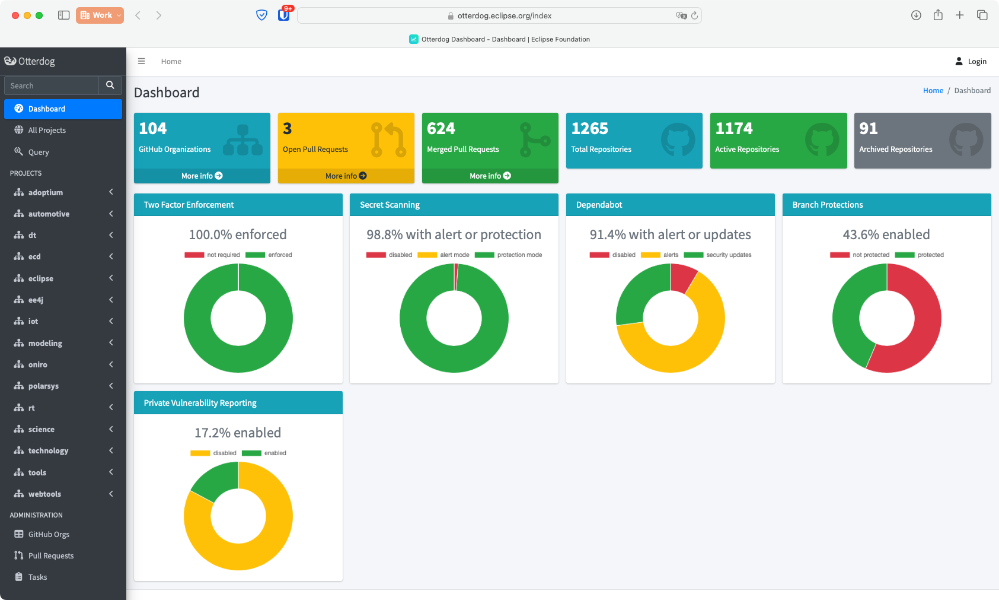
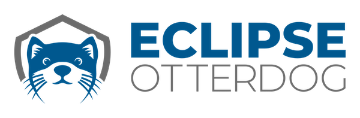

# Eclipse Foundation Update — May 2024

## Management of GitHub Organizations and Repositories

The number of Eclipse Foundation projects incorporating OtterDog has reached 104, marking an increase of 5 since the end of April. OtterDog now manages the configuration of 1,265 repositories.

This month's updates include:
* Addition of dependabot charts and private vulnerability reporting to the dashboard (https://github.com/eclipse-csi/otterdog/pull/238)

* Similar to the Eclipse Common Security Infrastructure Project, we now have a logo for Eclipse OtterDog to get a brand identity. All OtterDog artwork are available on GitHub at https://github.com/eclipse-csi/.github/tree/main/artwork/eclipse-otterdog. 

## 2FA Everywhere

We have completed 2FA enforcement on all GitHub organization owned by Eclipse Foundation as per [our plan](https://gitlab.eclipse.org/eclipsefdn/helpdesk/-/issues/477#note_1610474). This means that all committers on all Eclipse Foundation projects must now have 2FA enabled in order to be able to push to their repositories. A blog post to celebrate the completion of this project is scheduled for early June.

## Vulnerability Management

The security audit of Eclipse kuksa has been completed. The audit covered the databroker and the Python client; it consisted of static analysis, manual code review and dynamic analysis with fuzzing. See announcement and details on the findings at https://blogs.eclipse.org/post/marta-rybczynska/eclipse-kuksa-security-audit-has-been-completed

We also have released 2 CVEs for Eclipse Projects:
* [CVE-2024-3933](https://cve.mitre.org/cgi-bin/cvename.cgi?name=CVE-2024-3933)
* [CVE-2024-4536](https://cve.mitre.org/cgi-bin/cvename.cgi?name=CVE-2024-4536)
* [CVE-2024-5165](https://cve.mitre.org/cgi-bin/cvename.cgi?name=CVE-2024-5165)

## Presentations and outreach

On May 21-22, we participated to Software and Supply Chain Assurance (SSCA) Forum at MITRE, in McLean, VA. 

On May 24, we submitted a project proposal to the [Sovereign Tech Fund](https://www.sovereigntechfund.de), aiming to augment and expand our current activities funded by the Alpha-Omega grant.

## Public Policy

We held our first interested parties call for the [Open Regulatory Compliance Working Group](https://outreach.eclipse.foundation/open-regulatory-compliance). The minutes, presented slide deck, and recording are [available online](https://www.eclipse.org/lists/open-regulatory-compliance/msg00018.html).

## Infrastucture Security

We developed a proof of concept for an internal dashboard to assist the infrastructure team in managing the patch levels of various machines and VMs used by the Eclipse Foundation. The solution is based on the open-source security platform [Wazuh](https://wazuh.com). 

On a different topic, we encountered an issue with our code signing services. The Eclipse Foundation operates an on-premise JAR signing service and a Portable Executable (e.g., `.exe`, `.dll`) signing service to facilitate the use of the Eclipse Foundation EV Code Signing certificate by its projects. 

In late May, we had to rotate the certificate as it was expiring. Since the last renewal, rules have changed, and the Certificate Authority now requires EV code signing certificates to be stored on a Hardware Security Module (HSM). We had to adapt the implementation and deployment of our services to accommodate the new certificate. However, the issue is not entirely resolved, as the switch to HSM has caused a significant loss in performance and scalability. We are still investigating.

## Hiring

We published a new [job description](https://eclipsefoundation.applytojob.com/apply/hok1I7EqC5/Security-Software-Engineer-Open-Source) that is now listed on the [Eclipse Foundation Careers page](https://www.eclipse.org/careers/).