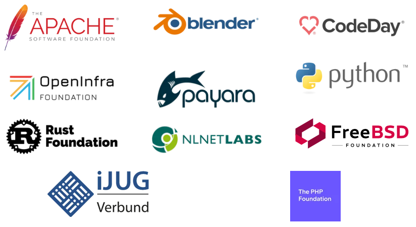

# Eclipse Foundation Update — June 2024

## Management of GitHub Organizations and Repositories

The number of Eclipse Foundation projects incorporating OtterDog has reached 107, marking an increase of only three since the end of May. OtterDog now manages the configuration of 1,306 repositories.

This month's updates include:

* Support for disabling default code security configurations, thanks to a recent [API addition](https://github.blog/changelog/2024-06-20-manage-code-security-configurations-via-api). With the introduction of [Code Security Configurations](https://github.blog/changelog/2024-04-02-code-security-configurations-let-organizations-easily-roll-out-github-security-products-at-scale/), security settings might get overwritten after a repository is created. For more details, see this [pull request](https://github.com/eclipse-csi/otterdog/pull/243).

OtterDog continues to be strongly used by Eclipse Foundation projects, as they created 58 configuration changes during the month (for a total of 682 since the begining of its deployment).

## 2FA Everywhere

Last month, we completed 2FA enforcement on all GitHub organization owned by Eclipse Foundation as per [our plan](https://gitlab.eclipse.org/eclipsefdn/helpdesk/-/issues/477#note_1610474). We published a [blog post](https://mikael.barbero.tech/blog/post/2024-06-06-2fa-campaign-completion/) and got some press coverage, notably in the German [Heise Online](https://www.heise.de/news/Eclipse-Foundation-macht-2FA-fuer-alle-Committer-verpflichtend-9755581.html).

## Public Policy

The [Open Regulatory Compliance Working Group](https://outreach.eclipse.foundation/open-regulatory-compliance) has been formally established, and the organizations listed below have completed the necessary paperwork. More organizations are expected to join in the coming weeks:

* Apache Software Foundation
* Blender
* CodeDay
* OpenInfra Foundation
* Payara
* Python Software Foundation
* Rust Foundation
* NLNet Labs
* FreeBSD Foundation
* iJUG e.V.
* The PHP Foundation

## Infrastucture Security

Last month, we encountered an issue with our code signing (both JAR signing and Authenticode) service. The mandatory switch to Hardware Security Module (HSM) for certificate storage has significantly impacted our performance and scalability.

We explored various "as-a-service" solutions, aiming to turn this crisis into an opportunity to eliminate our in-house, self-hosted setup and regain some cycles. Unfortunately, the market solutions do not scale to our needs, particularly in terms of pricing.

In parallel, we have begun investigating the use of Cloud HSM, which appears to be a promising trade-off. We are still in the prototyping phase and expect to have a comprehensive understanding of the pros and cons by the end of July. If this solution also proves undesirable, we will explore more robust physical HSMs than we have today and examine how we can scale our services across multiple devices.

## Security Audits

Two security audits have been completed and their report have been published.

### Eclipse Temurin

Eclipse Temurin is a part of the Eclipse Adoptium project. The Eclipse Temurin project provides code and processes that support the building of runtime binaries and associated technologies for general use across the Java ecosystem. Runtimes released by the Adoptium project count millions of downloads, so security of build scripts is critical for a large number of users.

The audit concentrated on areas like: the usage of secure HTTPS downloads, authenticity and integrity guarantees, state-of-the-art use of cryptography, hardcoded or otherwise exposed secrets or tokens.

Auditors worked closely with the project team to understand the code and provide feedback on the improvements. The report includes 19 findings with security implications and additional annexes with suggestions for code quality improvements. The high severity issues included:

* Possible code injection
* Software download and installation missing verification
* Disabled host verification

All security issues have been solved, by fixing the code, changes in the configuration and other means.

Check the [full report](https://ostif.org/wp-content/uploads/2024/06/Temurin-Final-Report-1.pdf) and our [blog post](https://blogs.eclipse.org/post/marta-rybczynska/eclipse-cyclonedds-security-audit-has-been-completed) for more information and details about the findings and fixes.

### Eclipse CycloneDDS

Eclipse CycloneDDS is an implementation of the Data Distribution Service (DDS) specification published by the OMG Standards Development Organization. The standard defined both the communication protocol and API for a publisher-subscriber model and is used in various fields including aerospace, defense, and autonomous vehicles. It had been developed at a time when malicious actors were less of a concern. To address new challenges in secure communication and in the presence of potentially malicious actors, the OMG has published DDS Security Specification introducing security plugins that implement authentication, access control and cryptographic operations. CycloneDDS supports that new specification. The correctness of the implementation was the main focus of the audit.

During the audit process, the auditors discussed frequently with the Project Team. They implemented three fuzzers to cover the desired functionality. Using those fuzzers, the auditors have found two issues with possible security impact and have given a number of recommendations to improve code quality.

Check the [full report](https://ostif.org/wp-content/uploads/2024/06/Pentest-Report-1.pdf) and our [blog post](https://blogs.eclipse.org/post/marta-rybczynska/eclipse-temurin-security-audit-has-been-completed) for more information and details about the findings and fixes.

## Hiring

We still have a [vacant position](https://eclipsefoundation.applytojob.com/apply/hok1I7EqC5/Security-Software-Engineer-Open-Source) on the team. We conducted several interviews throughout June, and a couple of strong candidates are now in the final stages of the selection process.
