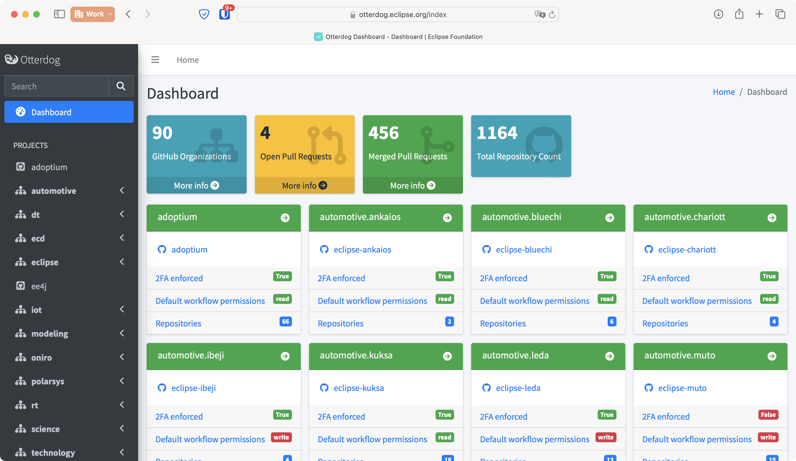
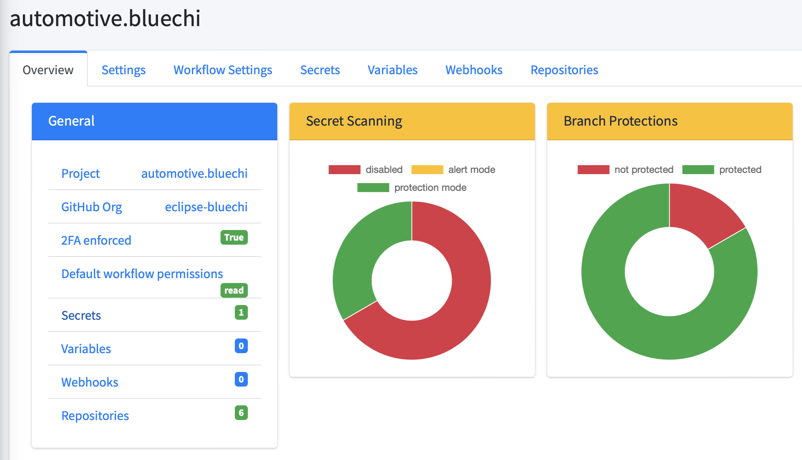

# Eclipse Foundation Update — February 2024
 
## Management of GitHub Organizations and Repositories

The number of Eclipse Foundation projects incorporating OtterDog has reached 90, marking an increase of 10 since the end of January. OtterDog now manages the configuration of 1,164 repositories.

The GitHub app is now deployed in production: https://otterdog.eclipse.org. All organizations with OtterDog benefit from automatic reviews and deployment of the submitted changes after merging by the security team, for example, see https://github.com/eclipse-tractusx/.eclipsefdn/pull/60.

The dashboard has been revamped and now displays much more information than before. It provides an easy way to capture, at a glance, the security posture of the projects, including important security configurations like 2FA enforcement, default workflow permissions, etc.

It also offers the opportunity to dive into each project's configuration with more details:

## 2FA Enforcement

We continue to implement our strategy as described in [this ticket](https://gitlab.eclipse.org/eclipsefdn/helpdesk/-/issues/477#note_1610474).

On February 2nd, we enforced 2FA on all GitHub organizations where all members already had 2FA enabled. Consequently, these organizations were already in full compliance with this new requirement. However, this means that moving forward, all new members will be required to activate 2FA before their invitation to join the GitHub organization can be extended. This action has increased the percentage of Eclipse Foundation-owned organizations with 2FA enabled from 18.5% to 64%.

On February 28th, we also sent a reminder to the 389 accounts without 2FA, informing them that starting April 30th, they will temporarily lose access to their repositories until 2FA is enabled.

## Security Policy

We've started revising our security policy and development processes to incorporate the concept of a "project security team" and outline the criteria for selecting its members. Draft changes are available for review at:

* https://gitlab.eclipse.org/eclipse/vhant/development-process/-/merge_requests/1/diffs
* https://gitlab.eclipse.org/eclipsefdn/emo-team/policies/security-policy/-/merge_requests/1/diffs
  
For a more detailed discussion on the rationale behind these changes, please refer to this community discussion: https://gitlab.eclipse.org/eclipsefdn/helpdesk/-/issues/1709#note_1844280 
