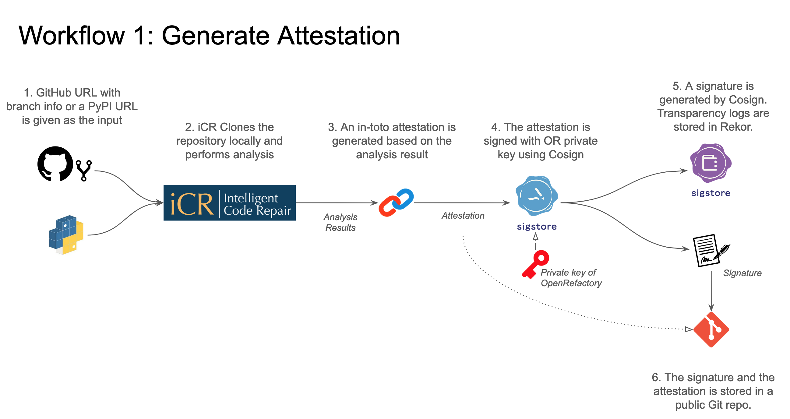
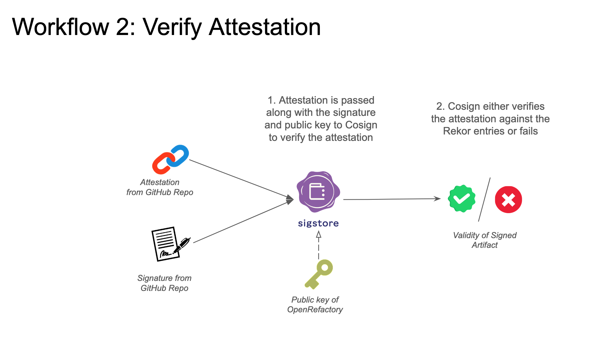

# OpenRefactory Update: February 2024

## Scan Results
Link to results: https://docs.google.com/spreadsheets/d/1K8dc6SrSEoqqh46cFisZM1tiN4CigaXsqkCKfCM8UTs/edit#gid=228743971

We first show the work done month over month. This is followed by the cumulative results. Finally we show language specific breakdown of the cumulative results.

### February
| Month                                | Dec 2023 | Jan 2024 | Feb 2024 |
|--------------------------------------|----------|----------|----------|
| Projects analyzed                    | 328      | 300      | 530      |
| Projects with no bugs                | 293      | 279      | 525      |
| Total bugs filed                     | 56       | 13       | 7        |
| Security/Reliability bugs filed      | 15       | 8        | 6        |
| Bugs with a fix suggestion           | 50       | 10       | 2        |
| Bugs with a PoC exploit              | 4        | 1        | 2        |
| Fixes merged by maintainers          | 27       | 10       | 5        |
| Security/Reliability fixes merged    | 6        | 6        | 2        |
| Fixes ignored by maintainers         | 1        | 1        | 1        |
| Reports still open                   | 28       | 2        | 1        |

### High Severity Bugs* (Cumulative)
| Month                     | Dec 2023 | Jan 2024 | Feb 2024 |
|---------------------------|----------|----------|----------|
| Weak Crypto               | 8        | 8        | 8        |
| Data Race                 | 2        | 5        | 5        |
| XSS                       | 5        | 5        | 7        |
| Log Injection             | 4        | 4        | 4        |
| Path Manipulation         | 0        | 0        | 3        |
| Insecure Deserialization  | 2        | 2        | 2        |
| Inappropriate umask       | 1        | 1        | 1        |
| Open Redirect             | 0        | 1        | 1        |
| Security Misconfiguration | 1        | 1        | 1        |
| Sensitive Data Leak       | 1        | 1        | 1        |
| SSRF                      | 1        | 1        | 1        |
| **TOTAL**                 | 25       | 29       | 34       |

* A high severity bug is any one of the following: (1) An injection related bug, (2) a weak cryptography related bug, (3) an access control related bug (4) a security or a reliability bug that is typically of medium priority but has been categorized as a high prioriy bug because it is found in a popular project (100+ forks).

### Cumulative Data
| Month                                | Aug 2023     | Sep 2023     | Oct 2023 | Nov 2023   | Dec 2023    | Jan 2024   | Feb 2024    |
|--------------------------------------|--------------|--------------|----------|------------|-------------|------------|-------------|
| Projects analyzed                    | 132          | 458          | 809      | 1,079      | 1,407       | 1,707      | 2,237       |
| Projects with no bugs                | 98           | 398          | 718      | 938        | 1,231       | 1,510      | 2,035       |
| Total bugs filed                     | 33           | 75           | 113      | 168        | 224         | 237        | 244         |
| Security/Reliability bugs filed      | 12           | 23           | 43       | 79         | 94          | 102        | 108         |
| Total high severity bugs filed*      | -            | -            | -        | -          | 25          | 29         | 34          |
| Bugs with a fix suggestion           | 26           | 64           | 94       | 140        | 190         | 200        | 202         |
| Bugs with a PoC exploit              | 6            | 13           | 18       | 22         | 26          | 27         | 29          |
| Fixes merged by maintainers          | 15 (45%)     | 38 (51%)     | 54 (48%) | 76 (45.3%) | 103 (46%)   | 113 (47.7%)| 118 (48.4%) |
| Security/Reliability fixes merged    | Not measured | Not measured | 13 (30%) | 25 (31.6%) | 31 (32.9%)  | 37 (36.2%) | 39 (36.1%)  |
| Fixes ignored by maintainers         | Not measured | 8 (11%)      | 7 (6%)   | 9 (5.3%)   | 10 (4.5%)   | 11 (4.6%)  | 12 (4.9%)   |
| Reports still open                   | Not measured | 29 (39%)     | 52 (46%) | 83 (49.4%) | 111 (49.5%) | 113 (47.7%)| 114 (46.7%) |

### Language Specific Data (Cumulative)
| Language                                       | Python   | Java | Go  | TOTAL |
| ---------------------------------------------- | -------- | ---- | --- | ----- |
| \# of total projects analyzed                  | 1,921    | 189  | 127 | 2,237 |
| \# of total zerofix projects                   | 1,755    | 169  | 111 | 2,035 |
| \# of total bugs filed                         | 200      | 22   | 22  | 244   |
| \# of total security/reliablity bugs filed     | 85       | 12   | 11  | 108   |
| \# of total bugs with fix suggestion           | 178      | 6    | 18  | 202   |
| \# of total POC exploit                        | 24       | 5    | 0   | 29    |
| \# of total merged fixes                       | 100      | 5    | 13  | 118   |
| \# of total merged security/reliability fixes  | 28       | 3    | 8   | 39    |
| \# of total ignored/rejected fixes             | 10       | 1    | 1   | 12    |
| \# of total open fixes                         | 90       | 16   | 8   | 114   |

##CVE Initiated
A couple of projects fixed the bugs that we reported and is in the process of creating CVEs.

In project MSS maintained by Open-MSS, we reported a path manipulation issue as a security advisory. The bug has been fixed and has been identified as critical. The project is undergoing the steps to request a CVE. More details here: https://github.com/Open-MSS/MSS/security/advisories/GHSA-pf2h-qjcr-qvq2

In project ckan we reported a log injection by emailing to a specific email address used for security issues. This has been accepted. The project is undergoing the steps to request a CVE.

##Attestation Workflows
We created two workflows that show how the attestations are to be generated and stored in a GitHub repository and how the the attestations are to be verified.

Workflow 1 shows the generation process.
[]

Workflow 2 shows the verification process.
[]

We will share some video snippets of the steps in the next month.

