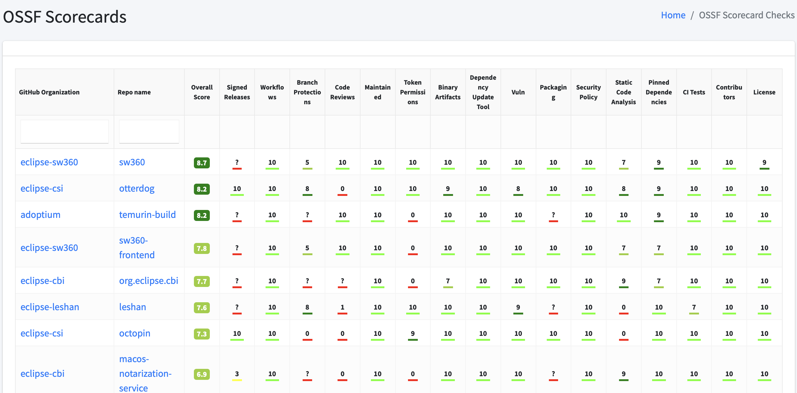

# Eclipse Foundation Update — January 2025

## Deployment of Blueprints across all GitHub Organizations

After successful testing of blueprints late last year, they have been extensively used to facilitate the creation of `.github` repositories and the deployment of a default `SECURITY.md` across all 240+ GitHub organizations managed with Otterdog. This process generated hundreds of PRs for individual projects to review. No opposition was encountered regarding these additions. The primary complaint came from maintainers responsible for multiple projects, who received a high volume of notifications within a short time. The blueprint definitions can be found here:

- [`.github` repository](https://github.com/EclipseFdn/otterdog-configs/blob/main/blueprints/add-dot-github-repo.yml)
- [Default security policy](https://github.com/EclipseFdn/otterdog-configs/blob/main/blueprints/default-security-policy.yml)

Blueprints serve as a mechanism to ensure that specific settings and files are present in projects. They can be defined at the global or organizational level. Any configured blueprint is also displayed on the dashboard, for example, for [Eclipse Mosquitto](https://otterdog.eclipse.org/projects/iot.mosquitto#blueprints).

Blueprints are applied in an additive manner, meaning multiple blueprints of the same type may be active for a single organization. To differentiate between them, an additional ID setting must be defined. If multiple blueprints share the same ID value, only the first encountered blueprint will be considered.

When a blueprint is defined for an organization, Otterdog checks whether the matching repositories comply with its configuration. If they do not, a PR is created to remediate the situation, such as by adding or updating a file. Committers within the organization must manually merge the PR but can edit it before doing so.

If a remediation PR is closed without being merged, the associated blueprint for that repository is marked as **DISMISSED**, and no further checks will be performed for that specific blueprint-repository pair. To reinstate the checks, the PR must be reopened.

## Support for Custom Teams

While the Eclipse Foundation manages the definition and permissions of core GitHub teams for each project (committers, project leads, security, contributors), some projects require additional teams to support more complex workflows in GitHub, such as those used in `CODEOWNERS` files.

Since team creation is restricted to organization administrators, individual projects previously lacked the ability to define their own teams. To address this, Otterdog has been enhanced to support the creation of custom teams. While specific permissions cannot be assigned to these teams—since permissions must be managed through other tools aligned with the Eclipse Foundation Development Process—several projects have already made use of this feature, including:

- [Adoptium](https://github.com/adoptium/.eclipsefdn/commit/85ea768c8d7b7f20e2bc9992a8993f955687c171)
- [Eclipse Nebula](https://github.com/EclipseNebula/.eclipsefdn/commit/b92bd0212424420e17e33fb2dcd98ec283ca6c43)
- [Eclipse Che](https://github.com/eclipse-che/.eclipsefdn/commit/ae62b52151e6c14e87b8b699842b5cc339b5c6c2)
- [Eclipse Simrel](https://github.com/eclipse-simrel/.eclipsefdn/commit/321bd8f04a50fe430ebfc297791d50655aa93296)

For more details, see the [pull request](https://github.com/eclipse-csi/otterdog/pull/363) introducing support for custom GitHub teams.

## Support for OpenSSF Scorecard

Otterdog now fetches the status of all GitHub repositories from the [OpenSSF Scorecard API](https://api.securityscorecards.dev) and displays it on [its dashboard](https://otterdog.eclipse.org/scorecard/checks).

Additionally, a [blueprint](https://otterdog.readthedocs.io/en/latest/reference/blueprints/scorecard-integration/) has been created to simplify the setup of a Scorecard workflow.

## Termination of Eclipse Forums

As a long-overdue **security improvement**, the Eclipse Forums, which were running on an outdated version of FUDForum, were replaced with a static, read-only copy on December 31, 2024. Multiple attempts had been made in the past to update the underlying setup, but all were unsuccessful. The outdated forum was [identified as a major security threat](https://gitlab.eclipse.org/eclipsefdn/helpdesk/-/issues/187#note_2849891) and had to be addressed promptly.

More details on this transition can be found [here](https://gitlab.eclipse.org/eclipsefdn/helpdesk/-/issues/187).
