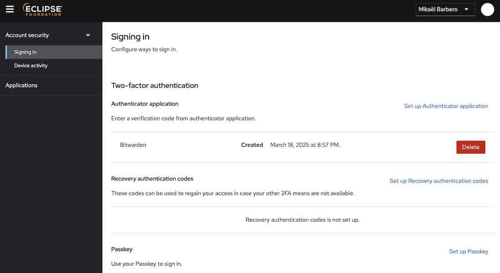

# Eclipse Foundation Update — April 2025

## Severe infrastructure outage

From April 23 to May 4, the Eclipse Foundation's on-premise infrastructure experienced a severe outage affecting its primary data backend. A detailed post-mortem is available on our [incident page](https://www.eclipsestatus.io/incident/549796). The root causes were multiple, but primarily:

* a network misconfiguration that went undetected during stress testing,
* inadequate monitoring of storage performance, and
* shared storage between compute and core services, which exacerbated the impact.

This incident mobilized a significant portion of the IT, release engineering, and security teams, who worked intensively to identify the issues (and rule out that root cause was not security-related), implement mitigations, restore services, and conduct a thorough audit of the affected systems.

From a security team standpoint, many services were either unavailable or operating in a degraded state during this period. Notably, both Otterdog and Dependency-Track were completely offline, and we are currently in the process of gradually restoring them.

## Otterdog improvments

We released two versions of Otterdog in April: [`1.0.1`](https://pypi.org/project/otterdog/1.0.1/) and [`1.0.2`](https://pypi.org/project/otterdog/1.0.2/).

These updates include the following fixes:

* Fixed support for recognizing `actions` as a code scanning language.
* Corrected coercion of the `has_discussion` property when the repository is the source of organization discussions.
* Fixed issues when importing organizations that define multiple custom properties.
* Resolved problems with updating organization teams using the `local-apply` operation.
* Added support for using a common DNS in MongoDB URL configurations.

## Stealth Launch of MFA for Eclipse Foundation Accounts

Over the past couple of years, we successfully reached 100% MFA enforcement for all project committers on both GitHub and `gitlab.eclipse.org`. However, the missing piece was enabling MFA on Eclipse Foundation accounts themselves. Since these accounts do not support social login, users are required to manage their own credentials.

The first step toward achieving this was migrating our IAM system from a non–OpenID Connect (Drupal-based solution) to Keycloak. With this transition complete (and 95% of our services now authenticating via OIDC with Keycloak) we were able to move forward with enabling MFA on `accounts.eclipse.org`.

This feature has been quietly launched in stealth mode: any user can now activate MFA from their Eclipse Foundation account, but we haven’t broadly advertised it yet, as we are still addressing a few final details. The two main items we're working on are:

* **Adding support for recovery codes.** This feature is still in beta in Keycloak, and we want to ensure it is stable and reliable before enabling it.

* **Finalizing the integration strategy with `gitlab.eclipse.org`.** While MFA is already enforced for committers on GitLab, it currently operates independently of the main authentication system. As a result, committers who enable MFA on their Eclipse Foundation account will face two MFA prompts when logging into GitLab: one via OIDC/Keycloak and another via GitLab’s native system. This is, of course, suboptimal, and we are actively working on a migration strategy to unify these experiences.

