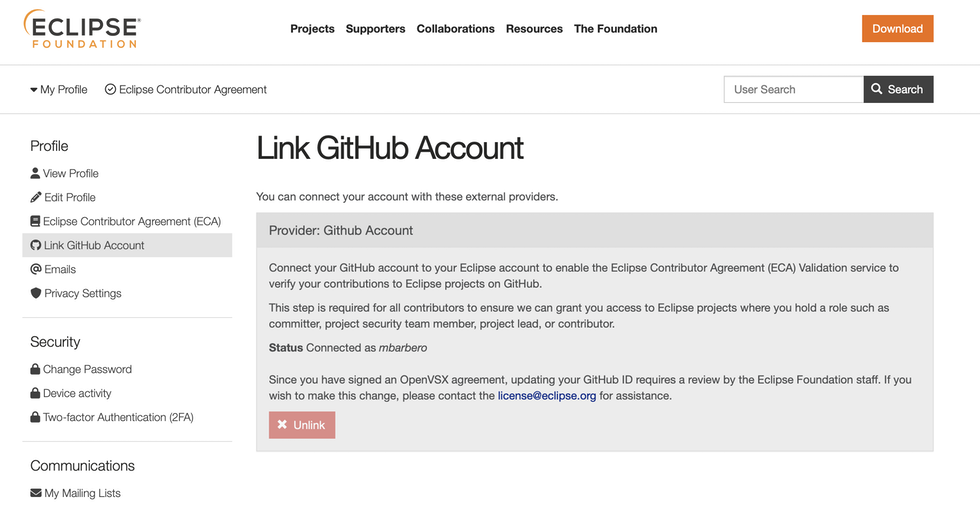

# Eclipse Foundation Update — May 2025

## Infrastructure outage remediation

Both Otterdog and Dependency-Track services have been restored to fully working state with no data loss.

## Rapid Security Review

We published our first Rapid Security Review Report, about the [Eclipse SysON Project](https://projects.eclipse.org/projects/modeling.syson), available from our [security webpage](https://www.eclipse.org/security/#insights-and-resources) and published a [blog post](https://blogs.eclipse.org/post/ioana-iliescu/our-first-rapid-security-review-eclipse-syson) about it.

Eclipse SysON successfully passed the majority of security checks, demonstrating a solid foundational security posture. These results highlight the project's strong security maturity and emphasize the value of the Rapid Security Review in supporting continuous improvement of projects resilience.

## Authenticated link to Github accounts

Last month, we launched MFA for Eclipse Foundation accounts in stealth mode, and it is still not generally available, as priority has been given to addressing the fallout from the recent outage. However, another security-related feature has also been introduced in stealth mode: the authenticated linking of Eclipse Foundation accounts and GitHub accounts.

Previously, EF users only needed to declare their GitHub ID, with no verification mechanism to ensure they were the legitimate owners of the associated account. This posed significant security risks, particularly in cases where a committer might mistakenly enter an incorrect GitHub username.

To eliminate this risk, EF accounts must now authenticate via GitHub to associate a GitHub account with their EF account. This new workflow is mandatory for all new accounts and will be gradually enforced for existing accounts over the coming months.

## Otterdog update

We have released two new versions of Otterdog: [`1.0.3`](https://pypi.org/project/otterdog/1.0.3/) and [`1.0.4`](https://pypi.org/project/otterdog/1.0.4/).

Recent development efforts have focused on improving the documentation and addressing behavioral changes in the GitHub API. Notably, the list of supported code scanning languages underwent a breaking change: two previously separate languages, `javascript` and `typescript`, were merged into a single value, `javascript-typescript`. While this change was applied automatically on the GitHub backend, the API began rejecting the old values, which was perceived as a regression by Otterdog users. This issue has now been resolved.

The documentation updates primarily target contributors, with a particular emphasis on setting up a test environment.

## Security Training

While this training has been funded by the Sovereign Tech Agency rather than Alpha-Omega, we wanted to share that a [security training session is scheduled](https://blogs.eclipse.org/post/marta-rybczynska/announcing-security-training-vulnerability-management-sbom-and-related) for June 3 and June 10, covering topics such as vulnerability management, SBOM, and related subjects.

The recording will be published shortly after the sessions, and we will include the links in our next report.
